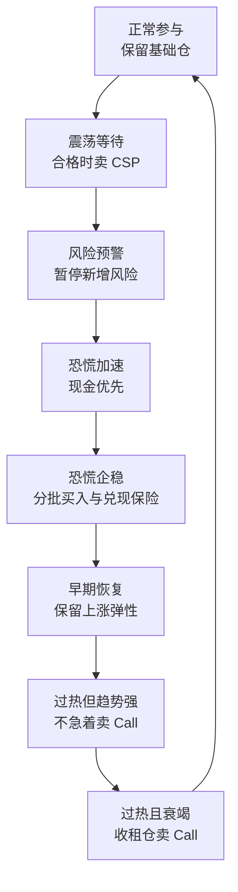

# 避风港全周期投资策略：总方案 v0.2

> 整合日期：2026-07-26  
> 当前状态：研究与回测版本，不是实盘参数  
> 已验证范围：使用 QQQ 识别市场环境，以 QQQ 为主执行标的；TQQQ 仅做压力研究  
> 回测区间：2016-07-25 至 2026-07-24，共 2515 个交易日  
> 核心原则：不追求猜中最低点，也不追求权利金最大化；目标是提高账户长期风险调整后收益

## 一、30 秒版结论

这套策略的完整逻辑是：

> **基础仓防止踏空 → 震荡期卖现金担保 Put 等待低价接货 → 风险预警时减少新增风险并配置保险 → 恐慌加速时保留现金 → 恐慌企稳后分批买入并兑现保险 → 恢复初期释放上涨空间 → 过热且上涨衰竭后，只对愿意卖出的收租仓卖 Covered Call。**

当前版本已经完成：

- `P 恐慌 + S 企稳 + G 贪婪 + E 衰竭 + R 权利金`五分数；
- 市场状态机、事件防抖和资金三层；
- QQQ/TQQQ 十年逐日回测；
- Covered Call、现金担保 Put 和保险的期权代理引擎；
- 100 股整数合约、现金占用、价差、滑点、费用和次日执行；
- 股票收益、权利金、保险、接货仓和 Call 封顶成本的独立记账。

但当前版本还不能进入 Paper：

1. 恐慌后的 `RECOVERY_RETESTED` 会过快释放 100% 事件预算；
2. 保险只明显改善了 2020，对 2018Q4 和 2022 几乎无效；
3. 贪婪指数卖 Call 单独使用反而轻微拖累收益；
4. 期权使用的是接近真实的代理估值，不是真实历史期权链；
5. TQQQ 完整版本最大回撤仍达 `-64.42%`，继续禁止自动化执行。

因此，`v0.2` 的正确定位是：

> **一套结构完整、可以继续迭代的研究底座，而不是已经通过实盘验证的最终策略。**

---

## 二、策略真正要解决的问题

单纯“恐慌抄底”会遇到四个问题：

1. 市场一直上涨时，长期空仓会踏空；
2. 恐慌很深但尚未企稳时，容易过早满仓；
3. 只买不防守，遇到 2022 这类持续熊市仍会承受大回撤；
4. 恢复后如果过早卖 Call，会把最有价值的反弹封住。

因此，策略不是单一买点模型，而是一个完整的账户循环：



这套策略不做以下事情：

- 不预测绝对最低点或最高点；
- 不因 VIX 单独超过 30 就一次性满仓；
- 不把宽基市场恐慌信号机械用于单只股票；
- 不把收到的毛权利金直接当作利润；
- 不用 Covered Call 冒充下跌保险；
- 不把 TQQQ 的多日收益简单视为 QQQ 的三倍；
- 不在没有真实期权链时声称复刻了历史成交。

---

## 三、总体架构

| 层级 | 核心任务 | 输出 |
|---|---|---|
| 市场识别层 | 计算 P、S、G、E、R | 当前市场状态 |
| 资金分层 | 基础仓、Put 接货仓、恐慌储备仓 | 可动用资金上限 |
| 风险与保险层 | 压力测试、自由现金、集中度、保险效率 | 风险否决或保险需求 |
| 执行层 | 直接买入、CSP、保险、Covered Call | 具体动作与数量 |
| 记账与评估层 | 分离股票、期权、保险、现金和机会成本 | 账户真实总收益 |

### 决策优先级

系统每天收盘后运行一次。发生信号冲突时，严格按以下优先级：

1. `DATA_GUARD`：数据不完整、过期或覆盖不足；
2. `HARD_RISK_BREACH`：账户压力损失、集中度或自由现金越界；
3. 已启动的恐慌事件及恢复阶段；
4. 风险预警；
5. 贪婪、上涨衰竭与权利金判断；
6. 普通上涨或震荡收租。

这意味着：

- 风险预算可以否决任何买入或卖期权信号；
- 恐慌后的快速反弹仍属于恢复期，不会被短期贪婪信号覆盖；
- 同一笔现金不能同时作为 Put 担保资金和恐慌储备；
- 所有未到期 Put 必须按“可能同时被指派”计算；
- 收租收益不能掩盖股票亏损或 Call 的上涨封顶成本。

---

## 四、五大评分系统

五个分数均为 `0～100`。当前默认使用约 5 年滚动百分位、极值截尾和 3 日平滑，只使用当日及历史数据。

| 分数 | 回答的问题 | 主要用途 |
|---|---|---|
| 恐慌分数 `P` | 市场是否出现价格错位和系统压力 | 判断值不值得准备买 |
| 企稳分数 `S` | 下跌是否开始减速、扩散是否改善 | 判断何时逐步买 |
| 贪婪分数 `G` | 市场是否过热、拥挤和低波动 | 判断是否进入潜在收租区 |
| 衰竭分数 `E` | 上涨趋势是否开始失去力量 | 避免强趋势中过早卖 Call |
| 权利金分数 `R` | 当前 Put 或 Call 是否值得交易 | 判断期权价格是否划算 |

### 1. 恐慌分数 P

| 组件 | 权重 |
|---|---:|
| 63 日回撤 | 12% |
| 252 日回撤 | 10% |
| 跌破 MA200 的幅度 | 8% |
| 5 日负收益 | 5% |
| VXN 水平 | 15% |
| VXN 五日上升 | 10% |
| 等权相对宽度 20 日恶化 | 10% |
| 等权相对宽度 63 日恶化 | 10% |
| 信用压力水平 | 5% |
| 信用利差恶化代理 | 5% |
| VIX/VIX3M 期限结构压力 | 10% |

分档：

- `P < 30`：正常；
- `30 ≤ P < 50`：风险预警；
- `50 ≤ P < 70`：恐慌；
- `70 ≤ P < 85`：严重恐慌；
- `P ≥ 85`：极端恐慌。

恐慌事件启动条件：

- `P ≥ 50` 连续两个交易日；或
- `P ≥ 70` 单日触发；
- 同时价格错位子分数至少达到 40，避免只因短时 IV 上升误触发。

### 2. 企稳分数 S

| 组件 | 权重 |
|---|---:|
| 5 日收益 | 10% |
| 10 日收益 | 10% |
| 站上 MA10 的强度 | 7.5% |
| 站上 MA20 的强度 | 7.5% |
| VXN 五日降温 | 10% |
| VXN 脱离 20 日高位 | 10% |
| 等权相对宽度 5 日改善 | 12.5% |
| 等权相对宽度 20 日改善 | 12.5% |
| 信用环境改善 | 10% |
| 五日不再创新低 | 10% |

分档：

- `S < 35`：仍在加速下跌；
- `35 ≤ S < 55`：初步止跌；
- `55 ≤ S < 70`：明确企稳；
- `S ≥ 70`：进入恢复。

关键组合：

- `P 高、S 低`：虽然便宜，但仍可能是接飞刀；
- `P 高、S 高`：才是主要恐慌部署区。

### 3. 贪婪分数 G

| 组件 | 权重 |
|---|---:|
| 20 日收益 | 10% |
| 63 日收益 | 10% |
| 站上 MA20 的幅度 | 10% |
| 低 VXN | 15% |
| 波动率期限结构处于 Contango | 10% |
| 站上 MA200 的幅度 | 10% |
| 252 日收益 | 10% |
| 20 日宽度集中 | 7.5% |
| 63 日宽度集中 | 7.5% |
| RSI | 5% |
| 10 日上涨日占比 | 5% |

分档：

- `G < 50`：正常；
- `50 ≤ G < 60`：偏热；
- `60 ≤ G < 75`：过热；
- `G ≥ 75`：极端过热。

### 4. 上涨衰竭分数 E

| 组件 | 权重 |
|---|---:|
| 短期动量减速 | 20% |
| MACD 回落 | 15% |
| 5 日宽度转弱 | 12.5% |
| 20 日宽度转弱 | 12.5% |
| 突破失败、跌回近期高点下方 | 20% |
| 放量下跌或冲高回落代理 | 10% |
| QQQ 相对 SPY 强度转弱 | 5% |
| RSI 从高位回落 | 5% |

分档：

- `E < 40`：上涨趋势仍完整；
- `40 ≤ E < 60`：开始转弱；
- `E ≥ 60`：明显衰竭。

`G` 与 `E` 必须分开：

- `G 高、E 低`：市场虽然很热，但趋势仍强，原则上不大量卖 Call；
- `G 高、E 高`：既过热又开始衰竭，才是主要收租窗口。

### 5. 权利金分数 R

目标完整版分别计算 `R_put` 和 `R_call`：

\[
R=35\%\times IV分位
+25\%\times(IV-RV)
+20\%\times净权利金收益
+20\%\times流动性
\]

分档：

- `R < 45`：不合格；
- `45 ≤ R < 60`：可用；
- `60 ≤ R < 75`：有吸引力；
- `R ≥ 75`：非常有吸引力。

当前十年回测没有真实历史期权链，因此代理版只完整获得：

- VXN/IV 分位；
- IV 相对 20 日实际波动率的溢价。

这两项合计最多覆盖目标 R 的 70%。执行价偏斜、真实 bid/ask、成交量和持仓量仍需真实期权链校准。

---

## 五、资金三层与风险预算

比例针对“批准投入本策略的独立 sleeve”，不是整个账户必须机械采用相同比例。

| 资金层 | 当前主方案 | 作用 |
|---|---:|---|
| 基础参与仓 | 35% | 长期保留市场参与，降低完全踏空风险 |
| Put 接货仓 | 20% | 为现金担保 Put 预留，按认可价格接货 |
| 恐慌储备仓 | 45% | 在恐慌企稳过程中分批买入，并保留机动性 |

对照方案：

- `50 / 15 / 35`；
- `60 / 10 / 30`。

基础仓越高，长期牛市收益越高，但回撤也会扩大；这不是单纯“哪个收益最高”的选择，而是收益与回撤的交换。

### 当前研究风险线

| 风险参数 | 上限 |
|---|---:|
| 账户标准压力损失 | NAV 的 15% |
| 普通单一风险因子压力损失 | NAV 的 6% |
| 单一杠杆 ETF 压力损失 | NAV 的 4% |
| 未被期权占用的最低自由现金 | NAV 的 25% |

### 本轮恐慌事件预算

\[
B_{\text{event}}=
\min
\left(
\begin{array}{l}
扣除最低现金线、Put担保和待成交订单后的自由现金,\\
单一资产剩余额度,\\
风险因子剩余额度,\\
剩余压力损失预算/新增资产边际压力跌幅
\end{array}
\right)
\]

当日最多新增：

\[
B_{\text{new}}=
\max
\left(
0,\ 
B_{\text{event}}\times 当前状态累计释放比例
-本轮已经部署
\right)
\]

“已经部署”包括：

- 本轮直接买入；
- 本轮新卖 Put 的完整潜在指派金额；
- 极端恐慌中的小试仓。

保险兑现产生的现金可以提高购买力，但不能突破当前状态的累计释放比例。

---

## 六、统一状态—动作表

表中的百分比是“本轮事件预算累计可释放比例”，不是每天重复买入的比例。

| 状态 | 核心判定 | 直接买入 | 现金担保 Put | 保险 | Covered Call |
|---|---|---|---|---|---|
| `DATA_GUARD` | 数据覆盖不足或过期 | 禁止 | 禁止新增 | 只管理已有风险 | 禁止新增 |
| `HARD_RISK_BREACH` | 压力损失、集中度或现金越界 | 禁止 | 禁止新增，必要时平仓 | 优先缩仓或补足有效保险 | 不得代替降风险 |
| `NORMAL_PARTICIPATION` | 无恐慌，`P<30` | 维持 35% 基础仓 | `R_put≥50`且净接货价合格时，最多使用一半 Put 仓 | 按风险缺口决定 | 默认关闭 |
| `RANGE_CARRY` | 低趋势、区间震荡、无恐慌 | 只做再平衡 | 最多使用全部 Put 仓，分执行价和到期日 | 通常不新增长期保险 | 联合门槛满足时最多覆盖 25% 收租仓 |
| `GREED_TREND` | `G≥60、E<40` | 不追高 | 暂停新增 | 只按风险缺口处理 | 默认关闭；极端过热时最多 10% |
| `GREED_EXHAUSTING` | `G≥60、E≥40` | 暂停追涨 | 关闭 | 可锁定利润或使用 Collar | 满足三重门槛时覆盖 25%～50% |
| `RISK_WARNING` | `30≤P<50` | 暂停战术买入 | 停止新增 | 保险尚未过贵时评估 Put Spread 或减仓 | 停止新增 |
| `PANIC_ACCELERATING` | 恐慌事件中，`P≥50、S<35` | 常规不买；极端时最多小试仓 | 禁止 | 持有并按条件兑现第一档 | 禁止 |
| `PANIC_STABILIZING_1` | `P≥50、35≤S<55` | 累计释放 15% | 仅为更低一档少量接货 | 保留主要保险 | 禁止 |
| `PANIC_STABILIZING_2` | `55≤S<70` | 累计释放 40% | 可为下一档接货，但全部指派后仍须合格 | 分批兑现保险 | 禁止 |
| `RECOVERY_EARLY` | `S≥70`，尚未完成回踩确认 | 累计释放 70% | 仓位不足时优先直接买 | 退出或移仓剩余保险 | 禁止 |
| `RECOVERY_RETESTED` | 站稳 MA20，完成回踩或五日不创新低 | v0.2 为累计 100%，这是当前主要缺陷 | 只在仍明显低估时允许 | 关闭多余保险 | 至少锁定 10 日，再重新评分 |

### RANGE_CARRY 初始定义

需同时满足：

- 20 日绝对收益不超过 5%；
- `ADX(14) < 20`，或 20 日内至少四次穿越 MA20；
- 20 日实际波动率不在过去五年最高 30%；
- 不存在有效恐慌事件。

### 恐慌事件退出与防抖

- `P < 30` 连续 10 个交易日后，事件结束；
- 状态升级可以单日发生；
- 状态降级原则上需连续两日确认；
- 已释放的事件预算不会因分数小幅回摆而机械卖出；
- 若重新跌破本轮低点，则从恢复状态退回恐慌状态并重新压力测试；
- 事件结束后的 10 个交易日继续禁止新卖 Call。

---

## 七、四个执行模块

### 1. 直接买入

买入由 `P + S + 风险预算`共同控制：

- 正常期只维持基础仓；
- 恐慌加速期以现金优先；
- 初步企稳累计部署 15% 事件预算；
- 明确企稳累计部署 40%；
- 早期恢复累计部署 70%；
- v0.2 回踩确认后累计部署 100%，但该规则已被十年回测证明过于激进，下一版必须重做。

### 2. 现金担保 Put

卖 Put 的定位是：

> **有报酬的限价买单，不是无风险收租。**

可接受净接货价：

\[
P_{\text{accept}}=
\min(P_{\text{signal}},P_{\text{valuation}},P_{\text{risk}})
\]

只有满足：

\[
K-C\leq P_{\text{accept}}
\]

才允许卖 Put。

当前代理参数：

| 参数 | 当前值 |
|---|---:|
| 目标期限 | 约 35 天，允许 28～50 天 |
| 区间期目标 Delta | 0.20 |
| 恐慌企稳期目标 Delta | 0.15 |
| 区间期最低净折价 | 5% |
| 初步企稳最低净折价 | 8% |
| 明确企稳最低净折价 | 10% |
| 止盈 | 收取初始权利金的 75% 后回补 |
| 现金担保 | 每张按 `K×100` 全额预留 |
| 自由现金 | 新开仓后仍不低于 NAV 的 25% |

额外硬门槛：

- 所有 Put 同时被指派后仍不过风险线；
- 单张 100 股不能使仓位超过上限；
- Put 担保资金只来自 Put 接货仓；
- ITM 到期必须生成 100 股接货仓，不能只记录权利金；
- 接货后股票损益单独记账。

### 3. 保险

保险的目标不是让 Put 本身长期赚钱，而是：

> **限制尾部损失，并在危机时提供可继续低吸的现金购买力。**

主结构为约 75 天 Put Spread：

| 参数 | 当前值 |
|---|---:|
| 长 Put | 约 `-0.25 Delta` |
| 短 Put | 约 `-0.10 Delta` |
| 覆盖比例 | 风险资产的 50% |
| 单次净保费上限 | NAV 的 0.75% |
| 年度毛保费预算 | NAV 的 1.5% |

当前建立条件：

- 进入 `RISK_WARNING`；
- `P ≥ 35`；
- `S < 55`；
- P 在五日内至少上升 8 分；
- 权利金没有贵到 `R > 85`。

当前兑现规则：

- `P≥70` 或保险盈利达到初始净保费的 100%：累计兑现 25%；
- `P≥85` 或进入 `PANIC_STABILIZING_1`：累计兑现至 75%；
- `S≥55` 且 P 连续下降，或风险消失，或距到期 10 天：退出或移仓。

保险引擎的选择顺序：

1. 缩小仓位；
2. Protective Put；
3. Put Spread；
4. Collar；
5. 暂不交易。

只有在能够有效填补风险缺口时，保险才有意义；不能为了“有保险”而机械买 Put。

### 4. 贪婪指数卖 Covered Call

卖 Call 必须同时考虑：

\[
G高 + E高 + R_{call}合格
\]

并且只能覆盖标记为 `INCOME` 的收租仓：

- 核心仓：默认不卖；
- 恐慌买入仓：恢复早期不卖；
- 收租仓：愿意在指定价格卖掉，才允许；
- Collar 中的 Call：归保险模块，不算普通收租。

当前门槛：

| 状态 | 联合门槛 | 最大覆盖 | 目标 Delta | 最低上涨空间 |
|---|---|---:|---:|---:|
| `RANGE_CARRY` | `G≥50、E≥40、R≥55` | 25% | 0.20 | 5% |
| `GREED_TREND` | `G≥75、R≥70` | 10% | 0.15 | 8% |
| `GREED_EXHAUSTING` | `R≥55` | 25% | 0.25 | 4% |
| 高度过热且明显衰竭 | `G≥75、E≥60、R≥60` | 50% | 0.25 | 4% |

其他规则：

- 目标期限约 35 天，允许 28～50 天；
- 收取初始权利金的 75% 后回补；
- 距到期 5 天或短期深度 ITM 时回补或移仓；
- 恐慌、风险预警、早期恢复阶段禁止新卖 Call；
- 恐慌事件结束后锁定 10 个交易日；
- 行权价与权利金必须满足：

\[
K+C\geq P_{\text{最低接受卖价}}
\]

- 投资者必须真正接受以该有效价格失去这 100 股；
- 毛权利金、回补成本、到期内在价值和封顶机会成本分别记账。

合约数量：

\[
N_{\text{call}}=
\left\lfloor
\frac{合格收租股数\times允许覆盖率}{100}
\right\rfloor
\]

100 股颗粒度具有决定性影响。若一张 Call 会使实际覆盖率明显超过允许上限，系统默认不交易。只有整批 100 股已明确划为收租仓时，才允许人工覆盖。

---

## 八、期权代理回测如何接近真实

当前没有可靠的十年逐日期权链，因此 v0.2 使用可校准代理模型，而不是固定添加“每月权利金收益”。

### 估值与执行

- QQQ 近月 ATM IV 以每日 VXN 为锚；
- TQQQ IV 使用其自身 20 日实现波动率相对 QQQ 的 63 日滚动比例放大，限制在 1.8～3.3 倍；
- 使用 Black-Scholes 生成每日理论中间价；
- 期限超过 30 天时，IV 向过去 252 日中位值缓慢回归；
- 10% 虚值 Put 的 IV 相对 ATM 增加约 15%，Call wing 轻微下调；
- QQQ 总点差按理论中间价 5% 估计，TQQQ 按 7%；
- 每腿每张开平仓费用为 0.65 美元；
- 所有信号延迟一个交易日执行；
- 全部使用 100 股整数合约；
- 月度到期日按第三个周五附近的实际交易日模拟；
- 期权持仓每日重新估值，而不是只在开仓与到期记账。

### 已纳入的真实损益结构

- Call 开仓权利金；
- Call 回补、到期内在价值和上涨封顶成本；
- CSP 权利金、担保现金、回补和指派；
- 指派后接货仓的股票损益；
- Put/Put Spread 的保费、每日估值和分批兑现；
- 价差、滑点、费用和现金占用。

### 尚未恢复的真实细节

- 真实逐日执行价链；
- 每个执行价的真实 bid/ask；
- 成交量和持仓量；
- 精确美式提前行权；
- 税务；
- 券商保证金规则。

因此，结果只用于判断方向和数量级，不能被描述为真实历史期权成交回放。

---

## 九、十年回测结果

### 1. QQQ 主结果

| 方案 | CAGR | 最大回撤 | Sharpe | 结论 |
|---|---:|---:|---:|---|
| 纯 P/S | 10.25% | -24.85% | 0.71 | 恐慌加仓提高收益，但风险效率不足 |
| P/S + 保险 | 10.17% | -24.85% | 0.71 | 当前保险拖累收益且几乎未改善总回撤 |
| P/S + 贪婪卖 Call | 10.23% | -24.85% | 0.71 | Call 单独没有创造正贡献 |
| P/S + Call + CSP | 10.58% | -24.77% | 0.73 | 正贡献主要来自 CSP |
| 完整策略 35/20/45 | **10.48%** | **-24.79%** | **0.73** | 当前 v0.2 主结果 |
| 完整策略 50/15/35 | 12.77% | -27.25% | 0.78 | 更高基础仓提高收益，也扩大回撤 |
| 完整策略 60/10/30 | 14.35% | -29.36% | 0.80 | 牛市参与更高，但风险更接近买入持有 |
| 静态 35% QQQ | 8.99% | -12.60% | 0.84 | 收益较低，但当前风险效率更好 |
| QQQ 买入持有 | 20.52% | -35.12% | 0.84 | 收益最高，但承受完整市场回撤 |

这组数据说明：

- 策略的确用较低市场暴露换取了更低于买入持有的回撤；
- 但相对于静态 35% QQQ，动态恐慌加仓并没有提高 Sharpe；
- 当前版本主要问题不是“收益太低”，而是为多出来的收益承担了过多增量回撤；
- 增加基础仓能提升 CAGR，但不能解决状态机和保险机制本身的问题。

### 2. 期权独立记账：50 万美元参考 sleeve

| 模块 | 毛现金流/投入 | 最终净损益 | 关键解释 |
|---|---:|---:|---|
| Covered Call | 收取权利金 18,678 美元 | **-1,888 美元** | 回补与上涨封顶吃掉了权利金 |
| Cash-Secured Put | 收取权利金 35,470 美元 | **+26,339 美元** | 当前主要正贡献；模拟指派 2 次 |
| Put Spread 保险 | 累计净入场保费 44,825 美元 | **-6,703 美元** | 只在部分危机中发挥作用 |
| 接货仓 | — | **+1,358 美元** | 必须与 CSP 权利金分开记账 |

最重要的结论：

> **权利金收入不等于利润。当前贪婪卖 Call 没有创造正收益；CSP 才是期权模块的主要正贡献。**

### 3. 保险在不同危机中的表现

| 压力阶段 | 纯 P/S 最大回撤 | 加保险后 | 结论 |
|---|---:|---:|---|
| 2018Q4 | -10.80% | -10.80% | 几乎无帮助 |
| 2020 暴跌与恢复 | -10.69% | -10.25% | 有小幅改善 |
| 2022 熊市 | -24.66% | -24.67% | 基本无效 |

因此，当前保险触发时点、覆盖比例或期限结构需要重做，不能因为 2020 有效就认为保险模块已经通过。

### 4. 期权代理敏感性

对 IV 使用 `0.9/1.0/1.1` 倍、点差使用 `0.75/1.0/1.5` 倍，共九组情景：

- QQQ 完整策略 CAGR 区间：`10.42%～10.56%`；
- 最大回撤区间约：`-24.90%～-24.70%`。

结果没有因为轻微调整 IV 或点差而完全翻转，但仍不能替代真实期权链验证。

### 5. 100 股颗粒度

| 参考资金 | Call 开仓次数 | CSP 开仓次数 | CAGR |
|---|---:|---:|---:|
| 10 万美元 | 0 | 16 | 10.35% |
| 25 万美元 | 29 | 24 | 10.49% |
| 50 万美元 | 35 | 27 | 10.48% |
| 100 万美元 | 35 | 27 | 10.49% |

小账户不能按比例复制大账户结果。不足 100 股时，Call、Put 或保险合约会直接归零；一张 Call 也可能覆盖过高比例的实际持仓。

### 6. TQQQ 压力研究

| 方案 | CAGR | 最大回撤 | Sharpe |
|---|---:|---:|---:|
| TQQQ 纯 P/S | 22.19% | -64.47% | 0.70 |
| TQQQ 完整策略 | 23.12% | **-64.42%** | 0.71 |
| 静态 35% TQQQ | 20.36% | -37.43% | 0.82 |
| TQQQ 买入持有 | 40.61% | -81.55% | 0.82 |

最终判定：

- 期权收益没有修复 TQQQ 的尾部风险；
- 2022 阶段完整策略仍回撤约 64%；
- TQQQ 继续仅保留压力研究；
- 不进入 Paper、Live、券商订单或自动交易；
- 不允许用 TQQQ 一比一替换 QQQ。

---

## 十、当前版本的三项核心问题

### 问题一：恢复期部署过快

`RECOVERY_RETESTED` 在站稳 MA20、完成简单回踩或五日不创新低后，就允许释放 100% 事件预算。

这在 V 型反转中有优势，但在 2022 这类持续熊市中会出现：

1. 第一轮下跌触发恐慌；
2. 短期反弹使 S 快速升高；
3. 模型把 QQQ 仓位从基础仓快速提高到高仓位；
4. 随后市场继续下跌，新增仓位承受第二段熊市。

这是当前最大结构性缺陷。

### 问题二：保险触发过晚或覆盖不足

保险建立条件过于依赖已经发生的 P 上升，导致：

- 快速暴跌时可能来不及建立；
- 慢熊中保险到期与风险窗口不匹配；
- 50% Put Spread 覆盖不足以显著改变账户级回撤；
- 保费支出没有稳定换来尾部改善。

### 问题三：卖 Call 的三重门槛仍不够好

虽然已经使用 `G + E + R`，但十年结果仍为负贡献，可能原因包括：

- 强趋势阶段仍有少量过早卖 Call；
- 代理 R 缺少真实 skew、流动性和执行价质量；
- 35 天期限与固定 Delta 没有适应不同趋势环境；
- 100 股颗粒度造成覆盖比例跳跃；
- 止盈与移仓规则增加回补成本。

因此，卖 Call 不能因为“贪婪高”就默认开启。

---

## 十一、v0.3 开发路线

### 第一优先级：重做恢复期资金释放

需要同时测试：

- 恐慌事件预算最高只释放 40%；
- 最高释放 70%；
- 70% 后只有在更严格的中期确认下才允许继续；
- 引入动态压力损失上限；
- 重新跌破事件低点时自动降低后续释放速度；
- 区分 V 型反转与持续熊市的恢复路径。

第一目标不是提高 CAGR，而是：

> **在不明显牺牲恢复行情参与度的前提下，显著改善 2022 型持续熊市的回撤。**

### 第二优先级：重做保险模块

需要比较：

- 更早的风险预警触发；
- 动态覆盖比例；
- 期限与风险窗口匹配；
- Protective Put、Put Spread、滚动保险和条件减仓；
- 保险成本上限与每单位保费降低的压力损失；
- 2018Q4、2020、2022 三种危机逐一通过，而不是只优化一段历史。

### 第三优先级：收紧 Covered Call

下一轮应比较：

- 默认关闭 Call；
- 只在 `G≥75、E≥60、R_call` 真实合格时开启；
- 更低覆盖率；
- 更短或更动态的到期日；
- 不同 Delta；
- 不回补、机械到期与主动移仓的差异；
- 只对 CSP 指派形成的收租仓卖 Call；
- 真实记录 Call 封顶机会成本。

进入 Paper 前，必须证明 Call 在不同牛市、震荡市和反转行情中有稳定净贡献；仅有毛权利金不算通过。

### 第四优先级：用真实期权链校准

至少需要校准：

- 实际执行价和到期日；
- Put skew 与 Call wing；
- bid/ask、成交量和持仓量；
- 真实成交可达性；
- 提前行权和除息影响；
- 真实佣金与保证金规则。

### 第五优先级：走步与样本外验证

- 参数只在训练窗口拟合；
- 下一窗口验证；
- 不按最终收益反向调参；
- 保留所有敏感性结果；
- 与静态仓位、定投和买入持有同时比较；
- 扩展到其他宽基或行业 ETF 前，先证明 QQQ 版本成立。

---

## 十二、进入 Paper 的硬门槛

只有同时满足以下条件，才允许考虑 Paper：

1. `RECOVERY_RETESTED` 不再机械释放 100%；
2. 相比静态 35% QQQ，动态策略的风险调整后收益有明确改善；
3. 2018Q4、2020 和 2022 三类压力中，保险具有稳定尾部改善；
4. Covered Call 扣除封顶成本后有稳健净贡献，或明确证明应默认关闭；
5. CSP 在真实期权链、真实点差和现金占用下仍有正贡献；
6. 所有未到期 Put 同时指派后仍不突破风险线；
7. 100 股颗粒度不会造成实际仓位越界；
8. 数据缺失时系统能够进入 `DATA_GUARD`；
9. 走步与样本外结果不依赖单一参数；
10. TQQQ 仍不进入自动交易。

---

## 十三、每日最终输出格式

```text
市场状态：PANIC_STABILIZING_1

恐慌分数 P：74
企稳分数 S：46
贪婪分数 G：18
衰竭分数 E：22
Put 权利金分数：63
Call 权利金分数：58
数据覆盖率：96%

基础参与仓：35% NAV
Put 接货仓：20% NAV
恐慌储备仓：45% NAV

本轮事件预算：18.0% NAV
本轮已经部署：1.5% NAV
当前累计释放上限：15%
本次最大新增：1.2% NAV

全部 Put 指派后压力损失：13.7% NAV
允许压力损失：15.0% NAV
风险缺口：0
未占用自由现金：27.5% NAV

直接买入：允许
现金担保 Put：只允许更低一档接货
保险：继续持有；达到条件时兑现 25%
Covered Call：禁止

否决原因：无
下一状态条件：S≥55，或重新跌破本轮事件低点
```

---

## 十四、当前项目状态

| 项目 | 当前状态 |
|---|---|
| 五大评分 P/S/G/E/R | 已实现 |
| 恐慌事件与状态机 | 已实现 |
| 三层资金与次日执行 | 已实现 |
| QQQ/TQQQ 十年回测 | 已完成 |
| Covered Call 代理 | 已接入逐日净值 |
| Cash-Secured Put 代理 | 已接入逐日净值 |
| Put Spread / Protective Put 代理 | 已接入逐日净值 |
| 100 股颗粒度 | 已实现 |
| 费用、价差、滑点 | 已实现 |
| 模块独立记账 | 已实现 |
| 真实历史期权链 | 未接入 |
| 恢复期动态风险上限 | 未实现 |
| 稳健保险模块 | 未通过验证 |
| Paper / Live | 未开启 |
| 生产策略、Shadow、券商订单 | 未修改 |

## 十五、最终判断

这套方案的框架是成立的：

- 基础仓解决踏空；
- CSP 解决震荡期的低价接货；
- P 与 S 解决恐慌中的买入时机；
- 风险预算决定可以买多少；
- 保险理论上解决尾部损失和危机购买力；
- G、E、R 决定何时可以对收租仓卖 Call；
- 独立记账防止“只看权利金，不看总收益”。

但十年结果也证明了三个现实：

1. 恐慌买入不等于自动提高风险效率；
2. 保险不是买了 Put 就一定有效；
3. Covered Call 也不是天然的收益增强器。

因此，当前最合理的推进顺序是：

> **先修复恢复期过快加仓 → 再证明保险真正降低尾部风险 → 再决定 Covered Call 应优化还是默认关闭 → 最后用真实期权链校准 CSP 与 Call。**

在这四步完成前，`v0.2` 继续保持研究状态；QQQ 可以继续迭代，TQQQ 只保留压力研究。

