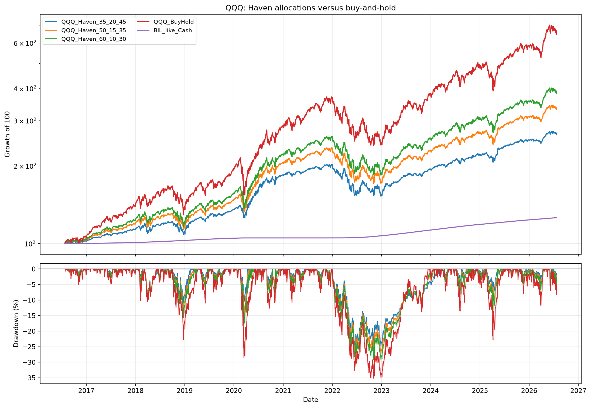
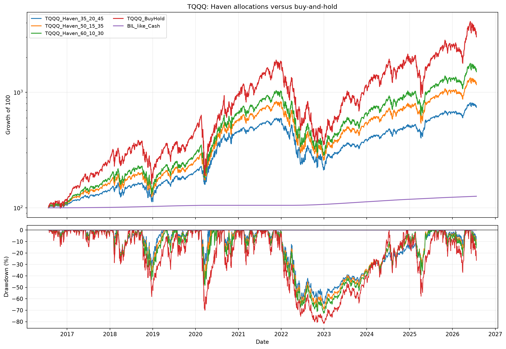
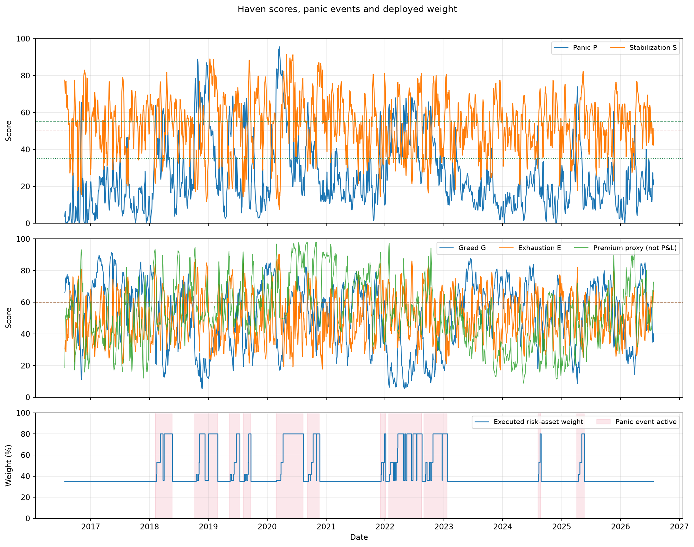

# 避风港全周期策略 v0.1：十年回测报告

> 回测区间：2016-07-25 至 2026-07-24  
> 交易日：2515  
> 性质：研究回测，不是实盘参数或交易建议

## 结论先行

- `QQQ_Haven_35_20_45` 十年累计收益为 165.22%，
  CAGR 为 10.25%，最大回撤为
  -24.85%。
- 与相同 35% 基础风险仓的静态方案相比，恐慌加仓把 CAGR 从
  8.99% 提高到 10.25%，
  但最大回撤从 -12.60% 扩大到
  -24.85%，Sharpe 从
  0.84 降至
  0.71。**v0.1 的 P/S 资金释放没有产生
  风险调整后的优势。**
- 同期 QQQ 买入持有累计收益为 546.05%，
  最大回撤为 -35.12%。这说明策略的核心取舍是
  用现金机会成本换回撤控制，而不是保证跑赢长期牛市。
- 三组 QQQ Haven 方案中，按超额现金 Sharpe 排名最高的是
  `QQQ_Haven_60_10_30`，但仍低于静态35% QQQ和 QQQ 买入持有。
- TQQQ 的无期权 sleeve 结果必须与账户级风险分开看：
  `TQQQ_Haven_35_20_45` 最大回撤为
  -64.47%，TQQQ 买入持有最大回撤为
  -81.55%。
- TQQQ 恐慌加仓相对静态35% TQQQ 只把 CAGR 从
  20.36% 提高到 22.19%，
  却把最大回撤从 -37.43% 扩大到
  -64.47%。**TQQQ 版本不通过 Paper 门槛。**
- 共识别 11 轮进入样本的恐慌事件，其中 11 轮在样本
  内完成退出。期权收益没有被理论模型伪造，因此当前结果只回答
  “评分＋状态机＋资金释放”是否有效。

### 当前研究判定

`P/S` 对 2018Q4、2020、2022 等压力阶段具有可解释性，但
`RECOVERY_RETESTED` 在 5 日不创新低并站上 MA20 后就允许释放 100% 事件预算。
在 2022 年这样的分段下跌中，短暂反弹会让风险仓从35%升到80%，随后继续
承受下跌；这是回撤扩大的主要结构性原因，而不是交易成本。

所以这一版的结论是：

1. 评分与事件日志可以保留；
2. `100%事件预算释放`需要重做，下一版先测试 40%/70%上限及动态压力约束；
3. 在资金释放优于静态基准前，不接真实 Put、Call，不进入 Paper/Live；
4. TQQQ 只保留压力研究，不作为当前可执行版本。

## QQQ 结果

| 策略 | 累计收益 | CAGR | 波动率 | Sharpe | 最大回撤 | 最差20日 | 平均风险仓位 |
|---|---:|---:|---:|---:|---:|---:|---:|
| QQQ_Haven_35_20_45 | 165.22% | 10.25% | 11.35% | 0.71 | -24.85% | -12.31% | 43.47% |
| QQQ_Haven_50_15_35 | 230.68% | 12.71% | 13.72% | 0.77 | -27.30% | -14.62% | 56.60% |
| QQQ_Haven_60_10_30 | 282.60% | 14.37% | 15.53% | 0.79 | -29.37% | -17.39% | 65.66% |
| QQQ_Static35 | 136.46% | 8.99% | 7.86% | 0.84 | -12.60% | -10.20% | 35.00% |
| QQQ_BuyHold | 546.05% | 20.52% | 22.46% | 0.84 | -35.12% | -27.85% | 100.00% |
| BIL_like_Cash | 25.98% | 2.34% | 0.12% | N/A | 0.00% | 0.00% | 0.00% |



## TQQQ 结果

| 策略 | 累计收益 | CAGR | 波动率 | Sharpe | 最大回撤 | 最差20日 | 平均风险仓位 |
|---|---:|---:|---:|---:|---:|---:|---:|
| TQQQ_Haven_35_20_45 | 641.28% | 22.19% | 33.64% | 0.70 | -64.47% | -33.98% | 43.47% |
| TQQQ_Haven_50_15_35 | 1063.33% | 27.82% | 40.65% | 0.75 | -69.09% | -39.46% | 56.60% |
| TQQQ_Haven_60_10_30 | 1404.88% | 31.16% | 46.01% | 0.77 | -72.65% | -46.01% | 65.66% |
| TQQQ_Static35 | 537.67% | 20.36% | 23.26% | 0.82 | -37.43% | -28.35% | 35.00% |
| TQQQ_BuyHold | 2917.19% | 40.61% | 66.45% | 0.82 | -81.55% | -67.48% | 100.00% |
| BIL_like_Cash | 25.98% | 2.34% | 0.12% | N/A | 0.00% | 0.00% | 0.00% |



## 五分数、恐慌事件与仓位



`R_proxy` 只由 VXN 与实现波动率构成，历史覆盖率被强制限制为 70%；
它不包含执行价偏斜、买卖价差、成交量、持仓量或提前指派，因此没有触发
期权交易，也没有计入收益。

## 危机阶段

| strategy | period | start | end | return | max_drawdown | worst_day |
|---|---|---|---|---|---|---|
| QQQ_Haven_35_20_45 | 2018_Q4 | 2018-10-01 | 2018-12-31 | -0.0832 | -0.1080 | -0.0307 |
| QQQ_Haven_35_20_45 | COVID_crash_recovery | 2020-02-19 | 2020-04-30 | 0.0367 | -0.1069 | -0.0431 |
| QQQ_Haven_35_20_45 | 2022_bear | 2022-01-03 | 2022-12-30 | -0.2264 | -0.2466 | -0.0403 |
| QQQ_Haven_50_15_35 | 2018_Q4 | 2018-10-01 | 2018-12-31 | -0.1031 | -0.1370 | -0.0326 |
| QQQ_Haven_50_15_35 | COVID_crash_recovery | 2020-02-19 | 2020-04-30 | 0.0152 | -0.1504 | -0.0611 |
| QQQ_Haven_50_15_35 | 2022_bear | 2022-01-03 | 2022-12-30 | -0.2500 | -0.2708 | -0.0428 |
| QQQ_Haven_60_10_30 | 2018_Q4 | 2018-10-01 | 2018-12-31 | -0.1173 | -0.1569 | -0.0345 |
| QQQ_Haven_60_10_30 | COVID_crash_recovery | 2020-02-19 | 2020-04-30 | 0.0019 | -0.1788 | -0.0731 |
| QQQ_Haven_60_10_30 | 2022_bear | 2022-01-03 | 2022-12-30 | -0.2699 | -0.2914 | -0.0453 |
| QQQ_BuyHold | 2018_Q4 | 2018-10-01 | 2018-12-31 | -0.1673 | -0.2269 | -0.0458 |
| QQQ_BuyHold | COVID_crash_recovery | 2020-02-19 | 2020-04-30 | -0.0654 | -0.2856 | -0.1198 |
| QQQ_BuyHold | 2022_bear | 2022-01-03 | 2022-12-30 | -0.3258 | -0.3483 | -0.0548 |
| TQQQ_Haven_35_20_45 | 2018_Q4 | 2018-10-01 | 2018-12-31 | -0.2556 | -0.3131 | -0.0879 |
| TQQQ_Haven_35_20_45 | COVID_crash_recovery | 2020-02-19 | 2020-04-30 | 0.0488 | -0.3038 | -0.1241 |
| TQQQ_Haven_35_20_45 | 2022_bear | 2022-01-03 | 2022-12-30 | -0.6119 | -0.6409 | -0.1192 |
| TQQQ_BuyHold | 2018_Q4 | 2018-10-01 | 2018-12-31 | -0.4746 | -0.5753 | -0.1360 |
| TQQQ_BuyHold | COVID_crash_recovery | 2020-02-19 | 2020-04-30 | -0.3919 | -0.6992 | -0.3446 |
| TQQQ_BuyHold | 2022_bear | 2022-01-03 | 2022-12-30 | -0.7897 | -0.8090 | -0.1646 |

## 恐慌事件日志

| event_id | start | end | completed | trading_days | low_date | max_P | max_S | max_deployment_fraction | ndx_return_during_event | ndx_max_drawdown_from_start |
|---|---|---|---|---|---|---|---|---|---|---|
| 1 | 2018-02-06 | 2018-05-22 | True | 74 | 2018-02-08 | 63.7094 | 81.7382 | 1.0000 | 0.0341 | -0.0540 |
| 2 | 2018-10-09 | 2019-02-28 | True | 97 | 2018-12-24 | 88.9104 | 89.0520 | 1.0000 | -0.0372 | -0.1997 |
| 3 | 2019-05-13 | 2019-07-15 | True | 44 | 2019-06-03 | 69.0355 | 73.4723 | 1.0000 | 0.0878 | -0.0473 |
| 4 | 2019-08-06 | 2019-09-20 | True | 33 | 2019-08-23 | 67.5742 | 88.3165 | 1.0000 | 0.0402 | -0.0075 |
| 5 | 2020-02-25 | 2020-08-12 | True | 119 | 2020-03-20 | 95.5472 | 91.3375 | 1.0000 | 0.2629 | -0.2083 |
| 6 | 2020-09-08 | 2020-11-20 | True | 54 | 2020-09-23 | 65.5329 | 87.0742 | 1.0000 | 0.0757 | -0.0212 |
| 7 | 2021-12-03 | 2022-01-05 | True | 23 | 2021-12-20 | 60.4262 | 81.2409 | 1.0000 | 0.0038 | -0.0054 |
| 8 | 2022-01-24 | 2022-08-18 | True | 144 | 2022-06-16 | 68.4174 | 81.2185 | 1.0000 | -0.0692 | -0.2331 |
| 9 | 2022-08-30 | 2023-01-23 | True | 100 | 2022-12-28 | 65.7288 | 80.6986 | 1.0000 | -0.0381 | -0.1348 |
| 10 | 2024-08-07 | 2024-08-26 | True | 14 | 2024-08-07 | 52.9243 | 72.8828 | 1.0000 | 0.0923 | 0.0000 |
| 11 | 2025-04-04 | 2025-05-22 | True | 34 | 2025-04-08 | 73.9471 | 82.1912 | 1.0000 | 0.2135 | -0.0177 |

## 状态分布

| state | trading_days | share |
|---|---|---|
| GREED_EXHAUSTING | 497 | 0.1976 |
| RANGE_CARRY | 352 | 0.1400 |
| GREED_TREND | 310 | 0.1233 |
| NORMAL_PARTICIPATION | 298 | 0.1185 |
| RISK_WARNING | 251 | 0.0998 |
| RECOVERY_RETESTED | 207 | 0.0823 |
| PANIC_STABILIZING_1 | 198 | 0.0787 |
| PANIC_STABILIZING_2 | 174 | 0.0692 |
| PANIC_ACCELERATING | 144 | 0.0573 |
| DATA_GUARD | 82 | 0.0326 |
| RECOVERY_EARLY | 2 | 0.0008 |

## 参数敏感性

下面只改变恐慌触发阈值和第一档企稳阈值，不从中挑选“历史最优参数”。

| panic_trigger | stabilization_1 | total_return | cagr | sharpe_excess_bil | max_drawdown | average_asset_weight |
|---|---|---|---|---|---|---|
| 45.0000 | 30.0000 | 1.7454 | 0.1063 | 0.7232 | -0.2437 | 0.4461 |
| 45.0000 | 35.0000 | 1.6769 | 0.1035 | 0.7159 | -0.2512 | 0.4407 |
| 45.0000 | 40.0000 | 1.5979 | 0.1002 | 0.7041 | -0.2778 | 0.4341 |
| 50.0000 | 30.0000 | 1.7230 | 0.1054 | 0.7224 | -0.2439 | 0.4400 |
| 50.0000 | 35.0000 | 1.6522 | 0.1025 | 0.7143 | -0.2485 | 0.4347 |
| 50.0000 | 40.0000 | 1.5430 | 0.0979 | 0.6899 | -0.2778 | 0.4286 |
| 55.0000 | 30.0000 | 1.7079 | 0.1048 | 0.7192 | -0.2427 | 0.4385 |
| 55.0000 | 35.0000 | 1.6381 | 0.1019 | 0.7107 | -0.2485 | 0.4334 |
| 55.0000 | 40.0000 | 1.5295 | 0.0973 | 0.6862 | -0.2778 | 0.4273 |

## 账户风险换算

资金 `35/20/45` 等比例针对独立策略 sleeve。下表用规格中的研究压力跌幅
把 sleeve 换算到账户级上限；这不是收益回测中的强制缩放。

| capital_split | asset | stress_drop_assumption | risk_loss_limit | baseline_asset_weight_in_sleeve | max_asset_weight_in_sleeve | max_account_share_at_baseline | max_account_share_at_full_deployment |
|---|---|---|---|---|---|---|---|
| split_35_20_45 | QQQ | 0.3500 | 0.0600 | 0.3500 | 0.8000 | 0.4898 | 0.2143 |
| split_35_20_45 | TQQQ | 0.6500 | 0.0400 | 0.3500 | 0.8000 | 0.1758 | 0.0769 |
| split_50_15_35 | QQQ | 0.3500 | 0.0600 | 0.5000 | 0.8500 | 0.3429 | 0.2017 |
| split_50_15_35 | TQQQ | 0.6500 | 0.0400 | 0.5000 | 0.8500 | 0.1231 | 0.0724 |
| split_60_10_30 | QQQ | 0.3500 | 0.0600 | 0.6000 | 0.9000 | 0.2857 | 0.1905 |
| split_60_10_30 | TQQQ | 0.6500 | 0.0400 | 0.6000 | 0.9000 | 0.1026 | 0.0684 |

## 方法与防前视

1. 恐慌、企稳等分数使用当日及此前约 5 年的滚动百分位，之后做 3 日平滑；
2. 所有当日收盘信号延迟一个交易日进入收益计算；
3. FRED 高收益债利差近年诊断列额外滞后一个交易日，不进入十年主信用代理；
4. 恐慌事件的资金释放比例是累计上限，事件内不会因评分小幅回摆机械卖出；
5. 事件退出后，v0.1 无期权版把战术 sleeve 重置到基础仓。这是为了让多轮
   恐慌可以独立比较，也是当前最重要的待验证假设之一；
6. 风险资产以外的资金使用 BIL-like 三个月国债现金代理：DGS3MO 滞后
   一日、扣除近似年费率，交易成本按单边换手 5bp 扣除；
7. 十年信用模块使用 HYG/IEF 市场代理；FRED 的 ICE BofA 利差免密下载
   目前只覆盖近约三年，因此仅保留作近年诊断，没有向前填充到早期样本；
8. ETF 价格使用 Nasdaq 历史行情，现金分红按除息日加入总收益；
9. 未计税费、融资、真实期权链、期权价差和提前指派。
10. 样本最初 82 个交易日因十年 RSP/SPY 与 HYG/IEF 代理尚未满足最短
    历史门槛而处于 `DATA_GUARD`，只保留基础仓。

## 当前阶段判断

这次回测可以验证：

- P/S 是否能在不同危机中形成可解释的事件；
- 分档释放能否改善回撤、最差 20/63 日和修复时间；
- 更高基础仓是否能缓解长期牛市中的现金拖累；
- TQQQ 路径下同一套状态机的风险是否过大。

这次回测不能验证：

- 卖 Put 的真实权利金、指派率和指派后损失；
- Protective Put、Put Spread、Collar 的真实保险效率；
- Covered Call 的真实收益与封顶机会成本。

下一阶段必须取得可靠的逐日期权链后，才允许把上述项目接入总收益。

## 数据清单

```json
{
  "warmup_start": "2011-07-01",
  "evaluation_start": "2016-07-25",
  "evaluation_end": "2026-07-24",
  "trading_days": 2515,
  "warmup_rows": 1273,
  "sources": {
    "market_prices": "Nasdaq historical API",
    "ndx": "FRED NASDAQ100",
    "credit": "HYG/IEF market proxy for 10-year scores; FRED BAMLH0A0HYM2 retained when available and lagged 1 day",
    "cash": "FRED DGS3MO lagged one day, less 0.1350% annual proxy expense",
    "volatility": "Cboe VXN/VIX/VIX3M histories"
  },
  "latest_dates": {
    "qqq": "2026-07-24",
    "tqqq": "2026-07-24",
    "ndx": "2026-07-27",
    "vxn": "2026-07-27",
    "credit": "2026-07-24",
    "cash_yield": "2026-07-24"
  },
  "model_constraints": {
    "lookahead": "close signal at t, weight effective at t+1",
    "options_pnl_included": false,
    "premium_proxy_max_coverage": 0.7,
    "transaction_cost_bps": 5.0,
    "cash_asset": "BIL-like DGS3MO cash proxy, lagged one day"
  }
}
```
